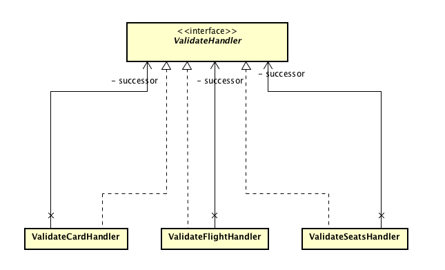
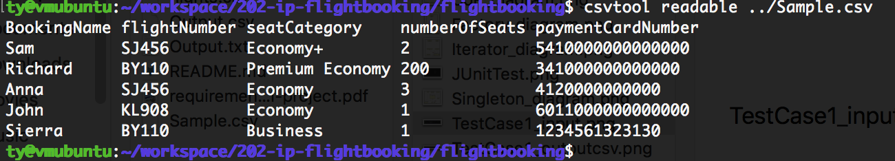
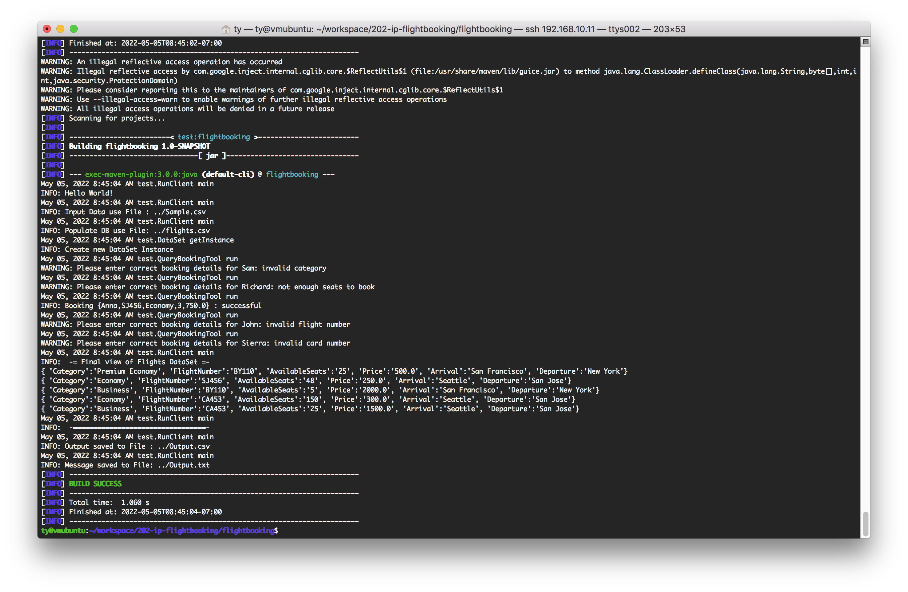
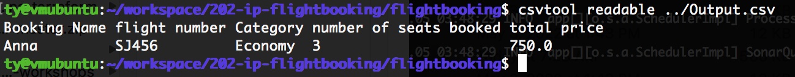
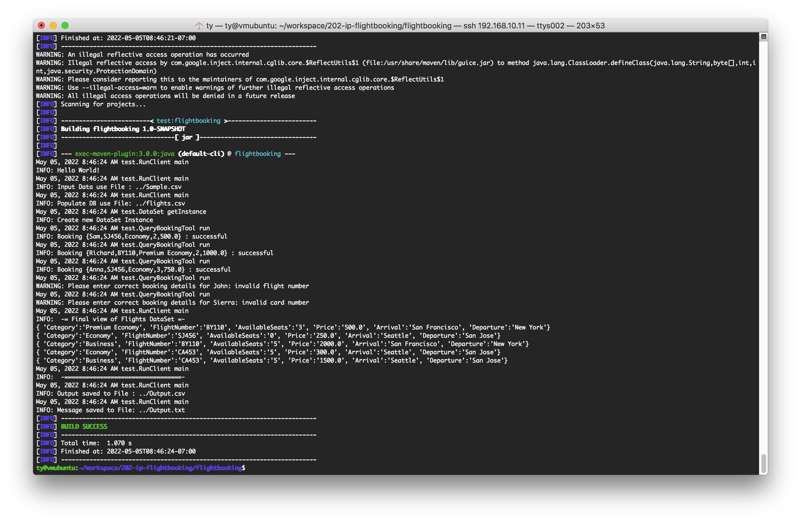

# individual-project-zisyang

- Name : Zi shun Yang
- SJSUID: 007562568
- CMPE-202 Sec 48 - SW Systems Engr


## Detailed instructions of building the project and steps to execute

1. Clone or download/unzip file from this repository, Open the command line where the project directory is located, e.g.
   ```
   cd <path to the project>/flightbooking
   ```
2. execute below steps
   ```
     mvn compile
     mvn clean install
   ```
3. Execute the below maven command to execute with arguments (Path to where the input file is located and path to where output file should be located) passed via command line
   ```
     mvn exec:java -Dexec.mainClass=test.RunClient -Dexec.args="<arg1> <arg2> <arg3> <arg4>"
   ```
   
   * arg1 – path to the input data (Sample.csv)
   * arg2 – path to flight details to populate DB (flights.csv)
   * arg3 – path to Output.csv
   * arg4 – path to Output.txt


## Problems Statement
1.  The primary problem is to extract the data from files for both flight detail information and input data, and store them into a dataset, which it needs to ensure that there's only one instance for entire data access.
2.  The secondary problem is to validate if the request is good to process in certain circumstance, such as, requested flight exists, the number of seats is available for the category, and also to check if the user's payment card is valid based on known rules for different credit card types.


## Design Patterns
- Singleton
  - To solve the first problem, Singleton is the best option, since it ensures that only one instance of a class is allowed within a system.
     | DataSet      |
     | ----------- |
     | -static datasetInstance |
     | -datasetData ...     |
     | ----------------------- |
     | +static getInstance()   |
     | +datasetOperstions...()  |


- Iterator
  - Iterator is used for traversal of the elements such as processing each booking in the list from top to bottom. It can do multiple processes while iterating each item, like create a processed list and a response message.

    
  

- Chain of Responsibility
  - The purpose of Chain of Responsibility is given more than one object an opportunity to handle a request by linking receiving objects together. To solve the second problem in this application design, the validation process uses this pattern to check if the request is acceptable to each rule. All the rules can be chained together so that the request can be easily handled by such a chain.

    

- Factory Method
  - Factory Method provides not only an interface to create objects, but also allows subclasses to control the actual operations. It's used to handle the output files for different file extension for each response object of the application.

    

## Class Diagram


## Screenshots of Test execution and result


#### Test Case 1
Flight Detail:


Input:



Output:



Output.csv:



Output.txt:


#### Test Case 2
Flight Detail:


Input:


Output:



Output.csv:


Output.txt:


